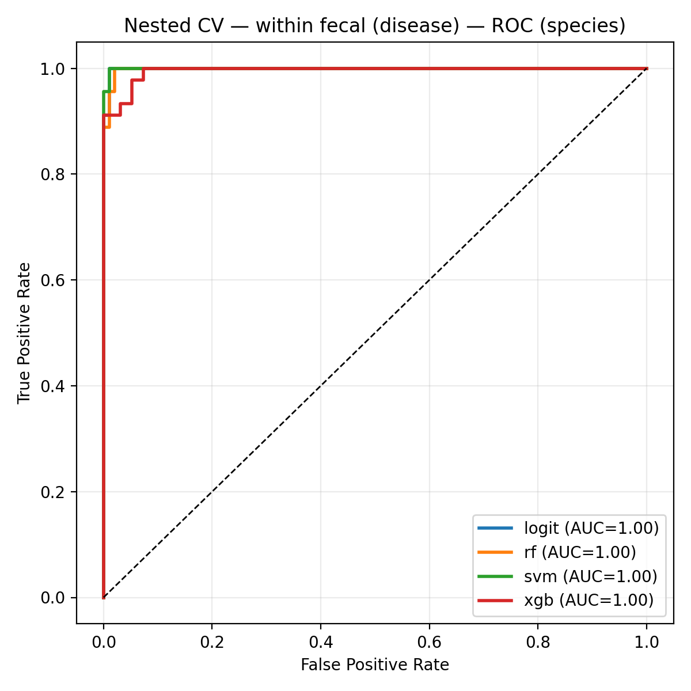
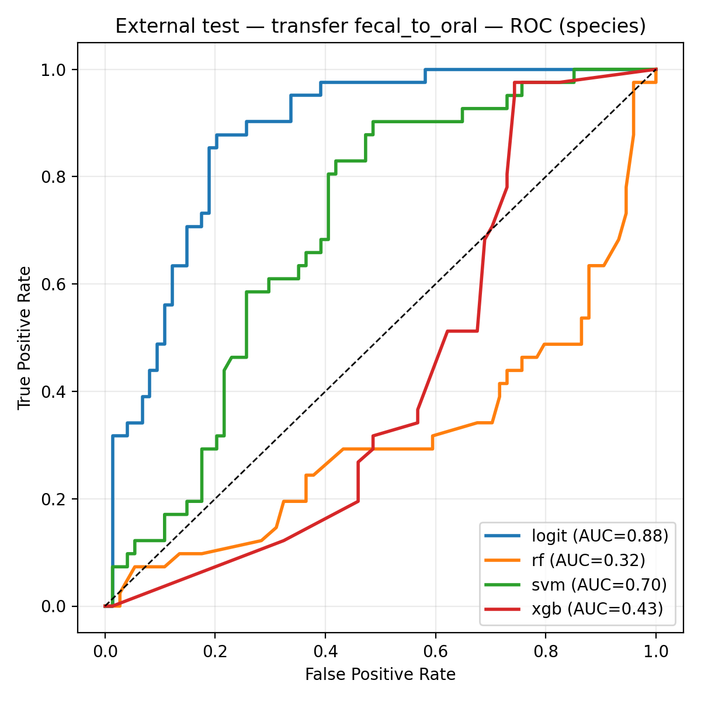

# Oral–Gut Microbiome Divergence and Predictive Modeling in Crohn's Disease

MSc thesis project · Data Science for Life Sciences · Hanze University of Applied Sciences, in collaboration with UMCG (2025)

A modular **Snakemake** workflow (Python + R) that takes MetaPhlAn4 taxonomic profiles from saliva (oral) and stool (fecal) shotgun metagenomes of people with Crohn's disease (CD) and healthy controls, and runs filtering, normalization, diversity analysis, differential abundance, and machine learning, including a test of whether a model trained on one body site still works on the other.

**Main finding:** body site (oral vs. gut) is by far the strongest driver of microbiome composition. Crohn's disease adds a clear shift in the gut microbiome that persists after covariate adjustment, while the oral disease signal disappears once covariates are taken into account.

## Research questions

1. How do the oral and gut (fecal) microbiomes differ between people with Crohn's disease and healthy controls?
2. How well can microbiome profiles separate CD from controls within each body site?
3. Does a disease classifier trained on fecal samples transfer to oral samples (and vice versa)?
4. Can the microbiome predict proton-pump inhibitor (PPI) use or treatment response within the CD group?

## Key results

| Analysis | Result |
|---|---|
| CD vs. controls, fecal (nested CV, ROC-AUC, 4 models) | 0.995–1.00 (n = 141; 45 CD) |
| CD vs. controls, oral (nested CV, ROC-AUC, 4 models) | 0.95–0.99 |
| Cross-site transfer, fecal → oral (external test set, n = 115; 41 CD) | Logistic regression 0.876 · SVM 0.70 · Random forest 0.32 · XGBoost 0.43 |
| Cross-site transfer, oral → fecal (external test set, n = 141; 45 CD) | SVM 0.74 · Logistic regression 0.65 · tree-based models 0.50–0.59 |
| PPI use prediction | Fecal ROC-AUC ≈ 0.58–0.65; oral near chance |
| Treatment response prediction (CD only) | ROC-AUC ≈ 0.5 (chance level) |
| Differential abundance, fecal (covariate-adjusted) | 204 of 351 taxa significant (q < 0.05) |
| Differential abundance, oral (covariate-adjusted) | 0 of 351 taxa significant |
| Paired oral vs. fecal within CD patients (n = 41 pairs) | 252 of 351 taxa differ (q < 0.05) |
| Fecal community composition (PERMANOVA R²) | 0.155 unadjusted → 0.070 after covariate adjustment |

<p align="center">
  
  
</p>

## How to read these results (limitations)

- **The near-perfect within-site AUCs should be seen as an optimistic upper bound.** They come from internal cross-validation on a moderate sample size without an external cohort. In addition, CD samples and healthy controls were collected in different cohorts (CD: UMCG; controls: Dutch Microbiome Project, and for most oral controls the US Human Microbiome Project), so disease status may be partly confounded with cohort and processing differences. The drop in fecal PERMANOVA R² after covariate adjustment (0.155 → 0.070) shows how much of the raw signal is shared with other factors.
- **Cross-site transfer depends strongly on the model.** Only logistic regression transferred reasonably (AUC 0.876, but poorly calibrated: Brier 0.34); tree-based models performed below chance on the other site.
- Healthy oral controls had limited metadata (7 of 12 DMP samples; none for the 62 HMP samples), which restricts covariate adjustment at the oral site.
- PPI use and treatment response could not be predicted reliably with the available sample size.
- All results come from one study population and have not been validated in an independent cohort.

## Data availability

| Group | Source | Oral | Fecal |
|---|---|---|---|
| Crohn's disease | UMCG cohort | 41 | 45 |
| Healthy controls | Dutch Microbiome Project (DMP/DAG3) | 12 | 96 |
| Healthy oral reference | Human Microbiome Project (HMP) | 62 | — |

The raw input data (MetaPhlAn4 profiles and clinical metadata) are governed by UMCG/DMP/HMP data-use agreements and are **not included** in this repository; access can be requested from the respective data custodians. `results/` contains aggregate outputs (figures, summary tables) from the thesis run; sample identifiers in these files are pseudonymized codes. Expected input files and their paths are listed in `config/config.yaml` under `raw_inputs`.

## Methods overview

- **Preprocessing:** harmonize MetaPhlAn4 tables, map sample IDs, identify matched oral–fecal pairs, add HMP oral reference profiles.
- **Filtering:** per body site, prevalence ≥ 20% and a relative-abundance threshold of 0.1% (see `config/config.yaml`), with QC plots (zero fraction, prevalence vs. mean, rank-abundance).
- **Diversity:** alpha diversity (Shannon, richness, evenness) at species and genus level; beta diversity with Bray–Curtis, Jaccard and Aitchison distances, PCoA, PERMANOVA / PERMDISP, with and without covariates (R, `vegan`).
- **Differential abundance:** CLR-transformed abundances; Mann–Whitney U tests (unadjusted), OLS models with HC3 robust standard errors adjusted for age, sex, BMI, smoking, recent antibiotics, steroids, immunosuppressants and PPI use, and Wilcoxon signed-rank tests for paired oral–fecal samples; Benjamini–Hochberg FDR.
- **Machine learning:** CLR-transformed microbiome features plus clinical covariates; elastic-net logistic regression, RBF-SVM, random forest and XGBoost; nested cross-validation (5 outer / 4 inner folds, fixed seeds); ROC, PR and calibration curves; learning curves; cross-site transfer evaluation on the other body site; consensus feature importance across models.
- **Software:** Python 3.10 (pandas, scikit-learn, statsmodels, scikit-bio), R 4.5 (vegan, phyloseq), Snakemake 7.32.

## Repository structure

```
.
├── SnakeFile                 # workflow definition
├── config/
│   ├── config.yaml           # input paths, thresholds, DA/QC/ML settings
│   ├── environment.yml       # Python environment (microbiome_pipeline)
│   ├── enviroment_r.yml      # R environment for beta diversity (r_vegan)
│   └── colors.yml
├── scripts/
│   ├── preprocessing.py
│   ├── filtering.py
│   ├── alpha_diversity.py
│   ├── beta_diversity.R
│   ├── taxa_comparison.py
│   ├── da_unified_module.py
│   ├── qc_unified.py
│   └── ml/
│       ├── data.py
│       ├── train.py
│       ├── cv_utils.py
│       └── summary_ml_results.py
└── results/                  # outputs of the thesis run
    ├── alpha/  beta/  taxa_compare/  qc/  da/
    └── ml/
        ├── within/  transfer/
        └── ml_summary/
```

## Installation

```bash
conda env create -f config/environment.yml
conda activate microbiome_pipeline
```

The R environment for beta diversity (`config/enviroment_r.yml`) is created automatically by Snakemake when `--use-conda` is used.

## Running the workflow

Place the input files at the paths given in `config/config.yaml`, then run:

```bash
snakemake -s SnakeFile --use-conda --cores 8
```

Individual steps:

| Step | Command |
|---|---|
| Preprocessing | `snakemake -s SnakeFile results/_flags/preprocessing.done --cores 4` |
| Filtering | `snakemake -s SnakeFile results/_flags/filtering.done --cores 4` |
| Alpha diversity | `snakemake -s SnakeFile alpha --cores 4` |
| Beta diversity (R) | `snakemake -s SnakeFile beta --use-conda --cores 4` |
| Differential abundance | `snakemake -s SnakeFile da --cores 4` |
| Machine learning (within-site + transfer + summary) | `snakemake -s SnakeFile ml --cores 8` |
| ML summary plots only | `snakemake -s SnakeFile ml_summary --cores 4` |

## Known issues

- In `summary_ml_results.py`, the transfer summary tables labelled `cv_summary` report training-CV metrics; use `external_summary_*.csv` for transfer performance (the transfer numbers above come from these files).
- Some genus-level differential abundance and transfer outputs duplicate the species-level results and are being checked.

## Citation

Esmaeili, M. (2025). *Oral–Gut Microbiome Divergence and Predictive Modeling in Crohn's Disease.* MSc thesis, Hanze University of Applied Sciences & UMCG.

## Contact

Maryam Esmaeili · maryam.esmaeili1985@gmail.com · [LinkedIn](https://www.linkedin.com/in/maryam-esmaeili-ds)
